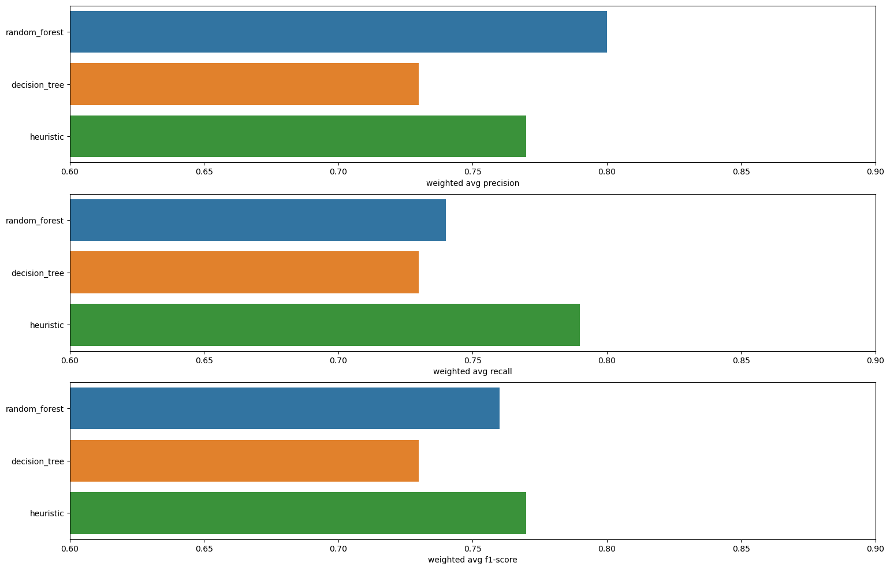
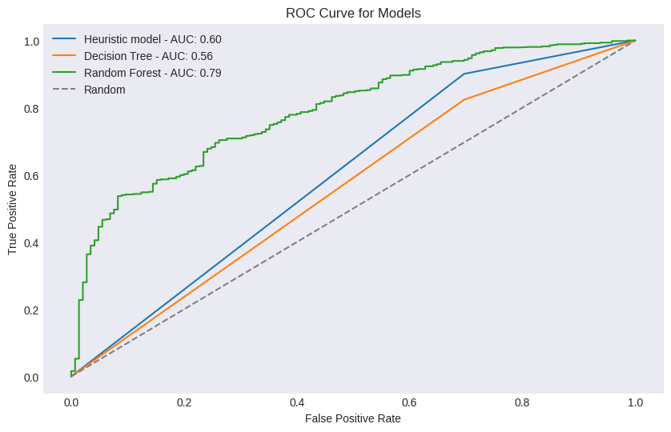
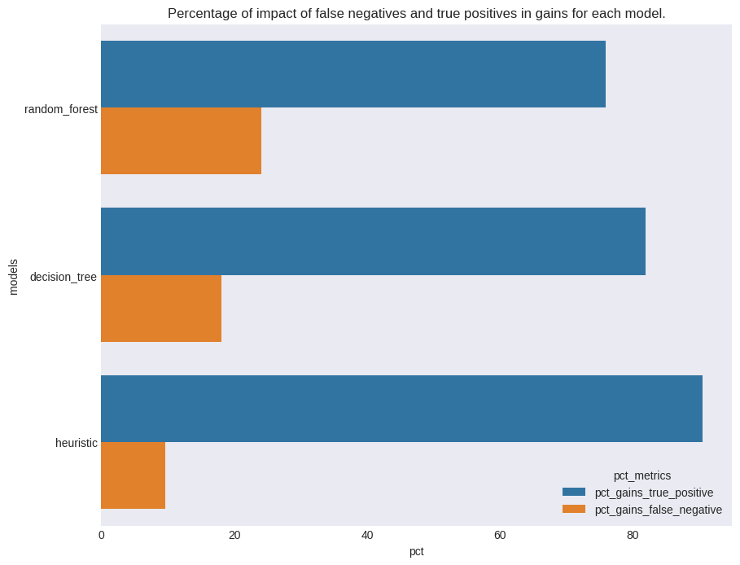
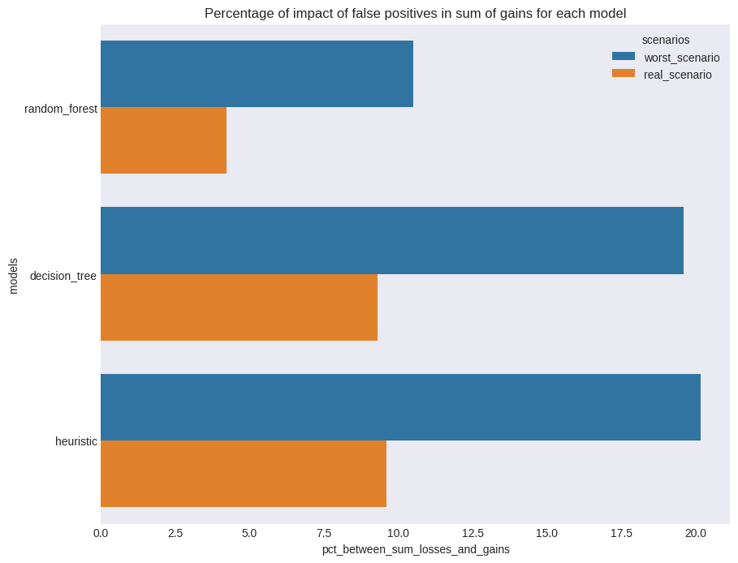
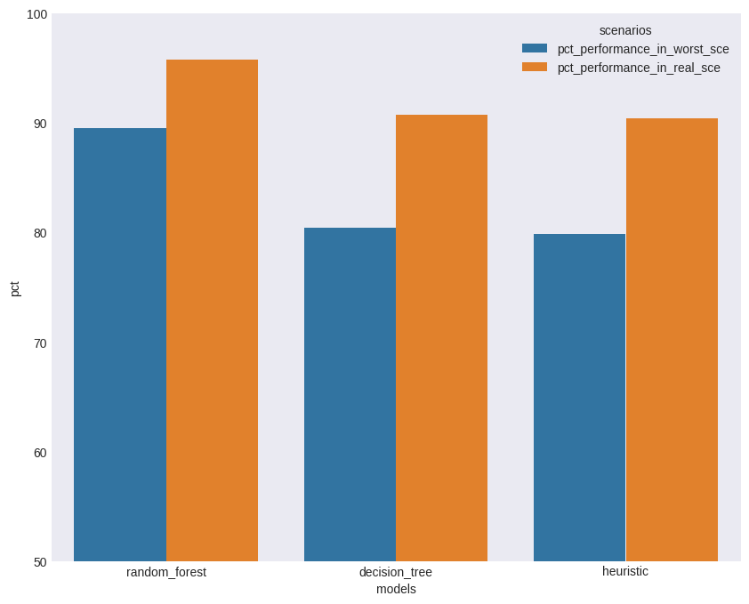
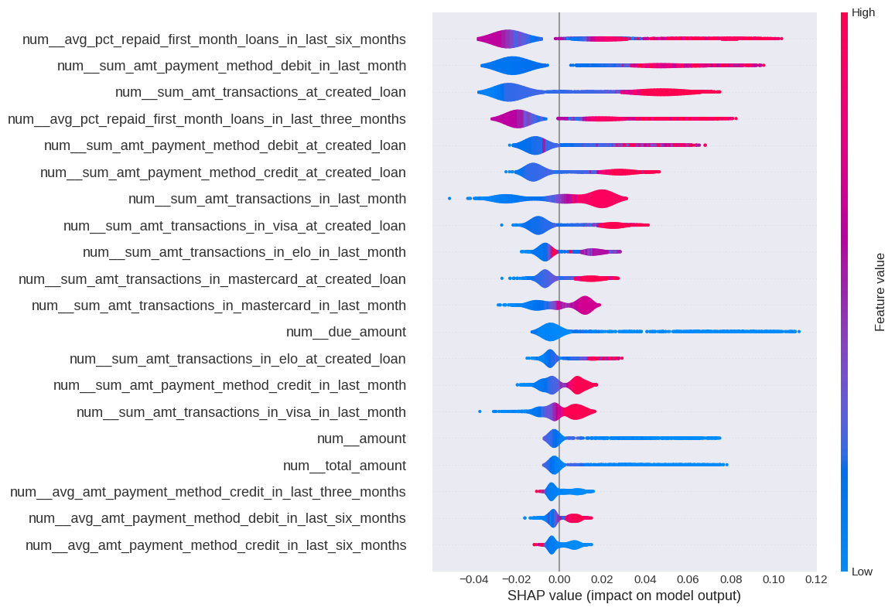

# Loans repayment prediction model

## What is the main problem to solve?

This project aims to predict loan repayments made in Sep/2022 and Oct/2022 using user transactions history and loans repayment history data.

## How is the dataset for the model?

The dataset is based from the three tabels in `/database/database.db`:

#### Loans Table
- **id (int)**: Unique identifier for the loan.
- **user_id (int)**: Unique identifier for the user who has taken the loan.
- **amount (float)**: The amount of loan disbursed.
- **total_amount (float)**: The amount of loan, including fees.
- **due_amount (int)**: The amount of the loan by the due date if there are no repayments during the contract period. Good to get interest rates.
- **due_date (object)**: The date by which the loan is due.
- **status (object)**: Current status of the loan (e.g., repaid, debt_collection, ongoing, debt_repaid).
- **repaid**: A loan that was was paid until due.
- **debt_collection**: A loan that was not paid until due.
- **debt_repaid**: A loan that was not paid until due but we recovered the money somehow.
- **cancelled**: A canceled loan.
- **error**: Operational error.
- **created_at (object)**: Timestamp of when the loan record was created. <u>Have it as the beginning of the loan</u>.

#### Loan Repayments Table
- **id (int)**: Unique identifier for the repayment record.
- **loan_id (int)**: The ID of the loan this repayment is associated with.
- **type (object)**: The type of repayment (e.g., autopilot, pix).
- **amount (float)**: The amount that was repaid.
- **status (object)**: Status of the repayment.
- **paid**: A loan repayment that effectively happened.
- **defaulted**: A loan repayment that didn`t come to reality.
- **refunded**: A loan repayment that happened but was fully refunded to the user. 
- **created_at (object)**: Timestamp of when the repayment record was created. <u>Have it as the moment of the repayment</u>.

#### Transactions Table
- **id (int)**: Unique identifier for the transaction.
- **user_id (int)**: The user ID associated with the transaction.
- **amount (float)**: Transaction amount.
- **status (object)**: Status of the transaction.
- **approved**: A transaction that happened.
- **denied**: A transaction that did`t happened due to it being denied.
- **capture_method (object)**: Method of capturing the transaction.
- **payment_method (object)**: Payment method used (e.g., credit, debit).
- **installments (int)**: Number of installments for the transaction.
- **card_brand (object)**: Brand of the card used for the transaction.
- **created_at (object)**: Timestamp of when the transaction record was created. <u>Have it as the moment the transaction happened</u>.

With this data, we can make joins and aggregations to construct user transactions history and loans repayment history. As most of our 
raw data is numeric, so is the resultant features for the models. The final dataset have this features:

- User transactions history:
    - at_loan_created: in the month of loan creation
        - `sum_amt_transactions_at_created_loan`: This calculates the sum amount of transactions between the first day of the month when the loan was created and the moment the loan was created.
        - `max_amt_transactions_at_created_loan`: This calculates the maximum value of transactions between the first day of the month when the loan was created and the moment the loan was created.
        - `most_frequent_transactions_payment_method_at_created_loan`: This calculates the most frequent payment method of transactions between the first day of the month when the loan was created and the moment the loan was created.
        - `sum_amt_payment_method_credit_method_at_created_loan`: This calculates the sum amount of transactions that uses credit as payment method between the first day of the month when the loan was created and the moment the loan was created.
        - `sum_amt_payment_method_debit_method_at_created_loan`: This calculates the sum amount of transactions that uses debit as payment method between the first day of the month when the loan was created and the moment the loan was created.
        - `sum_amt_transactions_in_visa_at_created_loan`: the amount of transactions between the first day of the month when the loan was created and the moment the loan was created that uses the visa card_brand.
        - `sum_amt_transactions_in_mastercard_at_created_loan`: the amount of transactions between the first day of the month when the loan was created and the moment the loan was created that uses the mastercard card_brand.
        - `sum_amt_transactions_in_elo_at_created_loan`: the amount of transactions between the first day of the month when the loan was created and the moment the loan was created that uses the elo card_brand.
        - `sum_amt_transactions_in_hipercard_at_created_loan`: the amount of transactions between the first day of the month when the loan was created and the moment the loan was created that uses the hipercard card_brand.
        - `sum_amt_transactions_in_amex_at_created_loan`: the amount of transactions between the first day of the month when the loan was created and the moment the loan was created that uses the amex card_brand.
        - `max_installments_at_created_loan`: The maximum installments value considere the transactions that happnend between the first day of the month when the loan was created and the moment the loan was created.
        - `median_installments_at_created_loan`: The median installments value considere the transactions that happnend between the first day of the month when the loan was created.
    - in_last_month: in the month before the loan creation
        - `sum_amt_transactions_in_last_month`: This calculates the sum amount of transactions between the first day of last month when the loan was created and first day of the month that the loan was created.
        - `max_amt_transactions_in_last_month`: This calculates the maximum value of transactions between the first day of last month when the loan was created and first day of the month that the loan was created.
        - `most_frequent_transactions_payment_method_in_last_month`: This calculates the most frequent payment method of transactions between the first day of last month when the loan was created and first day of the month that the loan was created.
        - `sum_amt_payment_method_credit_method_in_last_month`: This calculates the sum amount of transactions that uses credit as payment method between the first day of last month when the loan was created and first day of the month that the loan was created.
        - `sum_amt_payment_method_debit_method_in_last_month`: This calculates the sum amount of transactions that uses debit as payment method between the first day of last month when the loan was created and first day of the month that the loan was created.
        - `sum_amt_transactions_in_visa_in_last_month`: the amount of transactions between the first day of last month when the loan was created and first day of the month that the loan was created that uses the visa card_brand.
        - `sum_amt_transactions_in_mastercard_in_last_month`: the amount of transactions between the first day of last month when the loan was created and first day of the month that the loan was created that uses the mastercard card_brand.
        - `sum_amt_transactions_in_elo_in_last_month`: the amount of transactions between the first day of last month when the loan was created and first day of the month that the loan was created that uses the elo card_brand.
        - `sum_amt_transactions_in_hipercard_in_last_month`: the amount of transactions between the first day of last month when the loan was created and first day of the month that the loan was created that uses the hipercard card_brand.
        - `sum_amt_transactions_in_amex_in_last_month`: the amount of transactions between the first day of last month when the loan was created and first day of the month that the loan was created that uses the amex card_brand.
        - `max_installments_in_last_month`: The maximum installments value considere the transactions that happnend between the first day of last month when the loan was created and first day of the month that the loan was created.
        - `median_installments_in_last_month`: The median installments value considere the transactions that happnend between the first day of last month when the loan was created.
    - in_last_three_months: in the three months before the loan creation
        - `avg_amt_transactions_in_last_three_months`: This calculates the avg amount of transactions between the first day of the third month before the loan was created and first day of the month that the loan was created.
        - `max_amt_transactions_in_last_three_months`: This calculates the maximum value of transactions between the first day of the third month before the loan was created and first day of the month that the loan was created.
        - `most_frequent_transactions_payment_method_in_last_three_months`: This calculates the most frequent payment transactions method betweem the first day of the third month before the loan was created and first day of the month that the loan was created.
        - `avg_amt_payment_method_credit_method_in_last_three_months`: This calculates the avg amount of transactions that uses credit as payment method between the first day of the third month before the loan was created and first day of the month that the loan was created.
        - `avg_amt_payment_method_debit_method_in_last_three_months`: This calculates the avg amount of transactions that uses debit as payment method between the first day of the third month before the loan was created and first day of the month that the loan was created.
        - `avg_amt_transactions_in_visa_in_last_three_months`: the amount of transactions between the first day of the third month before the loan was created and first day of the month that the loan was created that uses the visa card_brand.
        - `avg_amt_transactions_in_mastercard_in_last_three_months`: the amount of transactions between the first day of the third month before the loan was created and first day of the month that the loan was created that uses the mastercard card_brand.
        - `avg_amt_transactions_in_elo_in_last_three_months`: the amount of transactions between the first day of the third month before the loan was created and first day of the month that the loan was created that uses the elo card_brand.
        - `avg_amt_transactions_in_hipercard_in_last_three_months`: the amount of transactions between the first day of the third month before the loan was created and first day of the month that the loan was created that uses the hipercard card_brand.
        - `avg_amt_transactions_in_amex_in_last_three_months`: the amount of transactions between the first day of the third month before the loan was created and first day of the month that the loan was created that uses the amex card_brand.
        - `max_installments_in_last_three_months`: The maximum installments value considere the transactions that happnend between the first day of the third month before the loan was created and first day of the month that the loan was created.
        - `median_installments_in_last_three_months`: The median installments value considere the transactions that happnend between the first day of the third month before the loan was created.
    - in_last_six_months: in the six months before the loan creation
        - `avg_amt_transactions_in_last_six_months`: This calculates the avg amount of transactions between the first day of the six month before the loan was created and first day of the month that the loan was created.
        - `max_amt_transactions_in_last_six_months`: This calculates the maximum value of transactions between the first day of the six month before the loan was created and first day of the month that the loan was created.
        - `most_frequent_transactions_payment_method_in_last_six_months`: This calculates the most frequent payment method of transactions betweem the first day of the six month before the loan was created and first day of the month that the loan was created.
        - `avg_amt_payment_method_credit_method_in_last_six_months`: This calculates the avg amount of transactions that uses credit as payment method between the first day of the six month before the loan was created and first day of the month that the loan was created.
        - `avg_amt_payment_method_debit_method_in_last_six_months`: This calculates the avg amount of transactions that uses debit as payment method between the first day of the six month before the loan was created and first day of the month that the loan was created.
        - `avg_amt_transactions_in_visa_in_last_six_months`: the amount of transactions between the first day of the six month before the loan was created and first day of the month that the loan was created that uses the visa card_brand.
        - `avg_amt_transactions_in_mastercard_in_last_six_months`: the amount of transactions between the first day of the six month before the loan was created and first day of the month that the loan was created that uses the mastercard card_brand.
        - `avg_amt_transactions_in_elo_in_last_six_months`: the amount of transactions between the first day of the six month before the loan was created and first day of the month that the loan was created that uses the elo card_brand.
        - `avg_amt_transactions_in_hipercard_in_last_six_months`: the amount of transactions between the first day of the six month before the loan was created and first day of the month that the loan was created that uses the hipercard card_brand.
        - `avg_amt_transactions_in_amex_in_last_six_months`: the amount of transactions between the first day of the six month before the loan was created and first day of the month that the loan was created that uses the amex card_brand.
        - `max_installments_in_last_six_months`: The maximum installments value considere the transactions that happnend between the first day of the six month before the loan was created and first day of the month that the loan was created.
        - `median_installments_in_last_six_months`: The median installments value considere the transactions that happnend between the first day of the six month before the loan was created.

- User loans repayment history:
    - in_last_month: in the month before the loan creation
        - `avg_repaid_total_amt_loans_in_last_month`: The average total_amount of loans repaid that a user had in last month.
        - `max_repaid_total_amt_loans_in_last_month`: The maximum value of loans repaid that a user had in last month.
        - `avg_pct_repaid_first_month_loans_in_last_month`: The average percentual of repayments in first month in the last month.
        - `avg_pct_repaid_sec_month_loans_in_last_month`: The average percentual of repayments in second month in the last month
        - `avg_pct_repaid_trd_month_loans_in_last_month`: The average percentual of repayments in third month in the last month.
        - `pct_repaid_loans_in_last_month`: The percentual of repaid loans of a user in the last month.
        - `most_frequent_loans_repayment_type_loans_in_last_month`: The most frequent form of repayment type for loans made by a user in the last month.
    - in_last_three_months: in the last three months before the loan creation
        - `avg_repaid_total_amt_loans_in_last_three_months`: The average total_amount of loans repaid that a user had in last three months.
        - `max_repaid_total_amt_loans_in_last_three_months`: The maximum value of loans repaid that a user had in last three months.
        - `avg_pct_repaid_first_month_loans_in_last_three_months`: The average percentual of repayments in first month in the last three months.
        - `avg_pct_repaid_sec_month_loans_in_last_three_months`: The average percentual of repayments in second month in the last three months
        - `avg_pct_repaid_trd_month_loans_in_last_three_months`: The average percentual of repayments in third month in the last three months.
        - `pct_repaid_loans_in_last_three_months`: The percentual of repaid loans of a user in the last three months.
        - `most_frequent_loans_repayment_type_loans_in_last_three_months`: The most frequent form of repayment type for loans made by a user in the last three months.
    - in_last_six_months: in the last six months before the loan creation
        - `avg_repaid_total_amt_loans_in_last_six_months`: The average total_amount of loans repaid that a user had in last six months.
        - `max_repaid_total_amt_loans_in_last_six_months`: The maximum value of loans repaid that a user had in last six months.
        - `avg_pct_repaid_first_month_loans_in_last_six_months`: The average percentual of repayments in first month in the last six months.
        - `avg_pct_repaid_sec_month_loans_in_last_six_months`: The average percentual of repayments in second month in the last six months
        - `avg_pct_repaid_trd_month_loans_in_last_six_months`: The average percentual of repayments in third month in the last six months.
        - `pct_repaid_loans_in_last_six_months`: The percentual of repaid loans of a user in the last six months.
        - `most_frequent_loans_repayment_in_last_six_months`: The most frequent form of repayment type for loans made by a user in the last six months.

## What model use? What are the baseline models?

For baseline models we used two models (heuristic - based on business rule - and decision tree - simple ML model -) and for the optimize model we used
the random forest, as it is based on an ensemble, it builds several "weak" decision trees but when seen their combined results ends up generating a strong model.

- Heuristic: Apply a business rule: approves a loan if the `total_amount` request is lower than `sum_amt_transactions_in_last_month`.
- Decision tree: Uses the features in `df_loans_with_loans_repays_hist_and_trans_hist_per_user_cleared.csv` and apply the decision tree.
- Random forest: Uses the features in `df_loans_with_loans_repays_hist_and_trans_hist_per_user_cleared.csv` apply random forest.

## How the optimize model is trained?

The optimize model it's trained using user transactions and loans repayment history data from Feb/2022 till Ago/2022 and for testing the model we used 
user transactions and loans repayment history data from Sep/2022 till Oct/2022.

For search the best hyperparameters we used the optuna lib and we selected the best values for `max_depth`, `n_estimators`,`min_samples_split`,
`criterion` and `class_weight` which are these: `max_depth`: 5,`min_samples_split`: 6,`n_estimators`: 480,`criterio`:gini,`class_weigh`:balanced_subsample.

Also for select the best features, we apply the Recursive feature elimination (RFE), where the features are selected recursively using cross validation, initially the subset is defined with all the features and then the importance of each one is calculated for the final result of the model is to remove the least relevant features until the minimum required features are reached. As cross-validation occurs, this process is repeated N number of times. The performance of these subsets of features is evaluated by a metric applied to the different quantities of selected features. Finally, the average performance of the N feature subsets is calculated and the one that maximizes the cross-validation metric is selected. ([See scikit-learn doc](https://scikit-learn.org/stable/modules/generated/sklearn.feature_selection.RFECV.html#sklearn.feature_selection.RFECV))

The advantage of using this with RF is to calculate the importance of the features using the concept of information gain from decision trees and choose the features that most influence the final result. So, the final features are: 
   - 'amount' 
   - 'total_amount' 
   - 'due_amount'
   - 'sum_amt_transactions_at_created_loan'
   - 'sum_amt_payment_method_credit_at_created_loan'
   - 'sum_amt_payment_method_debit_at_created_loan'
   - 'sum_amt_transactions_in_visa_at_created_loan'
   - 'sum_amt_transactions_in_mastercard_at_created_loan'
   - 'sum_amt_transactions_in_elo_at_created_loan'
   - 'max_amt_transactions_at_created_loan'
   - 'sum_amt_transactions_in_last_month'
   - 'sum_amt_payment_method_credit_in_last_month' 
   - 'sum_amt_payment_method_debit_in_last_month'
   - 'sum_amt_transactions_in_visa_in_last_month'
   - 'sum_amt_transactions_in_mastercard_in_last_month'
   - 'sum_amt_transactions_in_elo_in_last_month' 
   - 'max_amt_transactions_in_last_month'
   - 'avg_amt_transactions_in_last_three_months'
   - 'avg_amt_payment_method_credit_in_last_three_months'
   - 'avg_amt_payment_method_debit_in_last_three_months'
   -  avg_amt_transactions_in_visa_in_last_three_months'
   - 'avg_amt_transactions_in_mastercard_in_last_three_months'
   - 'avg_amt_transactions_in_elo_in_last_three_months'
   - 'avg_amt_transactions_in_last_six_months
   - 'avg_amt_payment_method_credit_in_last_six_months
   - 'avg_amt_payment_method_debit_in_last_six_months
   - 'avg_amt_transactions_in_visa_in_last_six_months
   - 'avg_amt_transactions_in_elo_in_last_six_months
   - 'max_amt_transactions_in_last_six_months
   - 'avg_repaid_total_amt_loans_in_last_month
   - 'max_repaid_total_amt_loans_in_last_month
   - 'avg_repaid_total_amt_loans_in_last_three_months
   - 'avg_pct_repaid_first_month_loans_in_last_three_months
   - 'avg_pct_repaid_sec_month_loans_in_last_three_months
   - 'avg_pct_repaid_trd_month_loans_in_last_three_months
   - 'max_repaid_total_amt_loans_in_last_three_months
   - 'avg_repaid_total_amt_loans_in_last_six_months
   - 'avg_pct_repaid_first_month_loans_in_last_six_months
   - 'avg_pct_repaid_sec_month_loans_in_last_six_months
   - 'avg_pct_repaid_trd_month_loans_in_last_six_months
   - 'max_repaid_total_amt_loans_in_last_six_months
   - 'pct_repaid_loans_in_last_six_months

## What results we have?

Let's check the gain of each model in relation to f1-score, precision, recall and AUC, revenue gains and losses and find out the impact of the features chosen on the optimized model.

|	    models  | weighted avg precision| weighted avg recall | weighted avg f1-score| AUC |
|---------------|-----------------------|---------------------|----------------------|-----|
|random_forest	|        0.80	        |        0.74	      |     0.76             | 0.79|
|decision_tree	|        0.73	        |        0.73	      |     0.73             | 0.5 |
|heuristic	    |        0.77	        |        0.79	      |       0              | 0.6 |

Regarding metrics, we see that the random forest performed better than the decision tree and had a similar performance to the heuristic model. In percentages, the weighted metrics obtained:
- The precision for the random forest achieved a gain of 9.6% for the heuristic model and 4% for the decision tree.
- Recall decreased by 6.3% in relation to the heuristic model and 1.3% in relation to the decision tree.
- Regarding the f1-score, we have a 4% gain compared to the decision tree and a 1.3% loss compared to the heuristic model.
- The AUC for the random forest achieved a gain of 31.7% for the heuristic model and 58% for the decision tree.

The random forest and the heuristic model obtained similar results, especially when viewing the weighted f1-score, even so, it had better precision performance when compared to other models, that is, it identified fewer false positives. Given our problem of classifying loan payments is the second metric to compare, lower false positive values mean fewer defaulting customers and greater gains in interest and fees for the company. Let's see the ROC curve.

Seeing the ROC curve we see that the best AUC is for the random forest model even for diferent types of false positive rates we see that the random forest have significant better performance that the other models.

For check the reveune gains, we will evaluate two cases:
  - Gain from loan repaid adjustments: The case in which the model correctly predicted the payment of the loan. In this case we earned interest and fees on the amount borrowed.
  - Gain in relation to false negatives: This is the case in which the model does not predict payment of the loan but it occurs. This is a case in which interest and fees are earned again.

So, we have these final results:

|models	       | sum_gains	    |    sum_true_positive_gains	 |   sum_false_negative_gains	|    pct_gains_true_positive	|    pct_gains_false_negative |
|--------------|----------------|--------------------------------|------------------------------|-------------------------------|-----------------------------|
|random_forest | 3711891.18	    |        2815946.08	             |   895945.10	                |    75.862840	                |  24.137160                  |
|decision_tree | 3711891.18	    |        3040525.29	             |   671365.89	                |    81.913104	                |  18.086896                  |
|heuristic	   | 3711891.18	    |        3355973.39	             |   355917.79	                |    90.411416	                |  9.588584                   |

For each model, how is the impact of false negative and true positive in gains? This is informed in the chart below:

We see that the heuristic model is the one that gives the greatest gains above the other models. Especially, for the true positives.

Now, we need to see the losses for each model, this is informed by the false positives, which is the loans repayments that was predicted to happen
but it didin't. Let's see the amount of losses table below.

|models	      |   sum_losses_in_worst_sce	  |  sum_losses_in_real_sce|
|-------------|-------------------------------|------------------------|
|random_forest |	    389690.70	          |  157078.40             |
|decision_tree |	    727073.54	          |  345337.71             |
|heuristic	  |      748453.10	              |  355921.41             |

It's important to notice that for this metric, we can have two scenarios:

- Worst scenario: where all customers do not pay any of the `total_amount`. The debt amount is given by `due_amount`.
- Real scenario: where some customers pay part of the `total_amount` value. In this case, the value of interest accrued on the amounts over the months from the creation of the loan to the `due_date` is calculated based on the interest rate when the loan was created.

For each model, how is the impact of false positives in losses? This is informed in the chart below:

From the table and chat above, we can see that the heuristic model is the one that had the bigger amount of losses, but, the random forest model was the one with the lowest amount of losses, this means that we achieve a more balance model, which can detect more precisely true positives. 

Now, let's check the final revenue we can get for each model. This answers the question: Removing the losses, what amount we
can preserve for each model gains? With the scenarios defined, the calculated revenue gains it's in the table below:

|models	        |  total_gains_worst_scenario	| total_gains_real_scenario	|  pct_performance_in_worst_sce |	 pct_performance_in_real_sce |  
|---------------|-------------------------------|---------------------------|-------------------------------|--------------------------------|             
|random_forest  |	   3322200.48	            |     554812.78	            |      89.501559	            |        95.768238               |
|decision_tree  |	   2984817.64	            |     3366553.47	        |          80.412315	        |        90.696448               |
|heuristic	    |      2963438.08	            |     3355969.77	        |          79.836340	        |        90.411319               |

The pct columns it's the ratio of the overall gains we had desconting the losses and the overall gain we had for the model. With this information we see that
the random forest it's the model that we least lose gains. This means that we can preserve in worst scenario 89.5% of the gains obtained and about 95.8% in the real scenario.

With all this information obtained, we can ensure that the optimize model we built it's the precise model to predict loans repayments. The weighted avg f1-score of the random forest was 0.76 (4% gain compared to decision tree and 1.3% loss compared to the heuristic model), precision 0.8 (4% gain compared to decision tree and 9.6 % in relation to the heuristic model), recall of 0.74 (gain of 1.3% in relation to the decision tree and decrease of 6.3% in relation to the heuristic model) and AUC of 0.79 (gain of 31.7% in relation to the heuristic model and 41% in relation to the decision tree).

Also,the random forest presented the greatest gain when compared to the decision tree and the heuristic model. Because this model is able to detect fewer false positives compared to others, the final result considering the real scenario was a gain in revenue above 3M, which, preserves for about 95% of the gains 
for this model. 

Also, let's see what features for the random forest model it's the most important. Let's see the SHAP chart.

Through SHAP we see some interesting features for the user to look at:

- A history of being a good payer is very important in determining whether or not a loan will be repaid, if the customer has had a history of being a good payer, this also influences other loans.
- The amount of spending in the month prior to the loan and in the month of the loan also has a positive influence, the greater the spending on transactions (whether in credit or debit or card brand), the greater the probability of the customer paying the loan.
- The value of the loan also matters, the lower the value, the greater the likelihood of paying the loan.

In other words, a good paying customer is the one who uses his account more, having higher expenses but who has a history of being a good payer, in addition, for low loan amounts, especially when compared to his transaction movement in the last month and in the month of creating the loan is even greater is the chance of there being a repayment of the amount.

## Futher improvements

As future improvements to the model, it is worth highlighting that we have more features such as features related to the user such as their average income, region of residence, whether they live in a large capital or not, because through this information we are able to capture possible patterns in relation to their expenses beyond of what is spent on transactions. Also, have more time related frequencies like week and days (last_7_days, last_2_weeks ...) and have more statistics for the features like standard deviation, median or variance can helps to improve the model.
